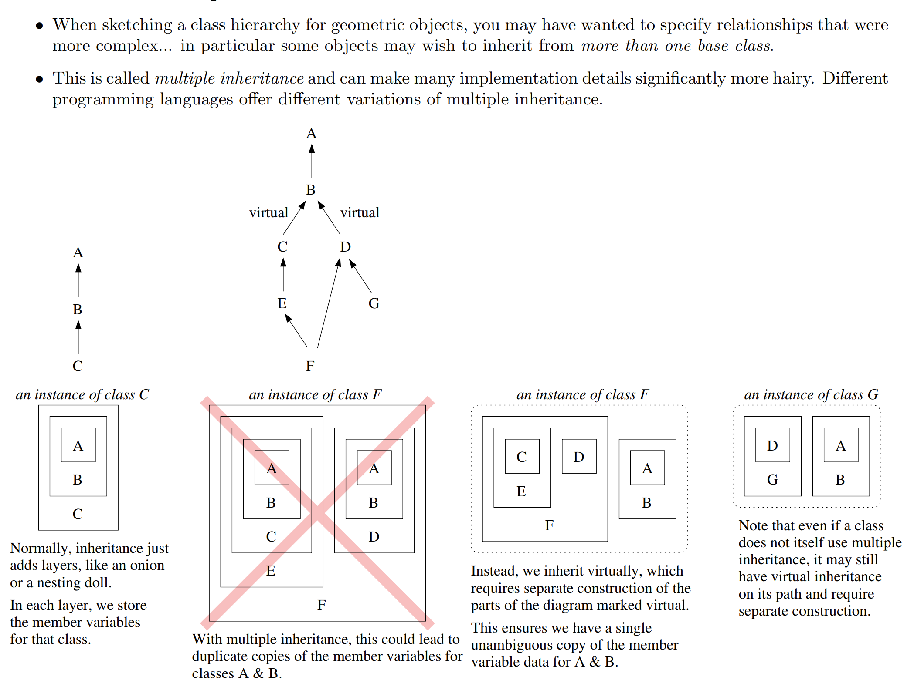

# Lecture 26 ---  C++ Inheritance and Polymorphism

## 26.1 Multiple Inheritance

- When sketching a class hierarchy for geometric objects, you may have wanted to specify relationships that were more complex... in particular some objects may wish to inherit from more than one base class.
- This is called multiple inheritance and can make many implementation details significantly more hairy. Different programming languages offer different variations of multiple inheritance.
- See [example 1](multiple_inheritance1.cpp) and [example 2](multiple_inheritance2.cpp).

- And see [example 3](multiple_level_inheritance.cpp) for a multiple level inheritance example.

  Note:

  

## 26.2 Introduction to Polymorphism

- Let’s consider a small class hierarchy version of polygonal objects:

```cpp
class Polygon {
public:
	Polygon() {}
	virtual ~Polygon() {}
	int NumVerts() { return verts.size(); }
	virtual double Area() = 0;
	virtual bool IsSquare() { return false; }
protected:
	vector<Point> verts;
};
class Triangle : public Polygon {
public:
	Triangle(Point pts[3]) {
	for (int i = 0; i < 3; i++) verts.push_back(pts[i]); }
		double Area();
	};
class Quadrilateral : public Polygon {
public:
	Quadrilateral(Point pts[4]) {
		for (int i = 0; i < 4; i++) verts.push_back(pts[i]); }
	double Area();
	double LongerDiagonal();
	bool IsSquare() { return (SidesEqual() && AnglesEqual()); }
private:
	bool SidesEqual();
	bool AnglesEqual();
};
```

- Functions that are common, at least have a common interface, are in Polygon.
- Some of these functions are marked virtual, which means that when they are redefined by a derived class, this new definition will be used, even for pointers to base class objects.
- Some of these virtual functions, those whose declarations are followed by = 0 are pure virtual, which means
they must be redefined in a derived class.  
  – Any class that has pure virtual functions is called “abstract”.  
  – Objects of abstract types may not be created — only pointers to these objects may be created.  
- Functions that are specific to a particular object type are declared in the derived class prototype.

## 26.3 A Polymorphic List of Polygon Objects

- Now instead of two separate lists of polygon objects, we can create one “polymorphic” list:

```cpp
std::list<Polygon*> polygons;
```

- Objects are constructed using new and inserted into the list:

```cpp
Polygon *p_ptr = new Triangle( .... );
polygons.push_back(p_ptr);
p_ptr = new Quadrilateral( ... );
polygons.push_back(p_ptr);
Triangle *t_ptr = new Triangle( .... );
polygons.push_back(t_ptr);
```

Note: We’ve used the same pointer variable (p_ptr) to point to objects of two different types.

## 26.4 Accessing Objects Through a Polymorphic List of Pointers

- Let’s sum the areas of all the polygons:

```cpp
double area = 0;
for (std::list<Polygon*>::iterator i = polygons.begin(); i!=polygons.end(); ++i){
	area += (*i)->Area();
}
```

Which Area function is called? If *i points to a Triangle object then the function defined in the Triangle
class would be called. If *i points to a Quadrilateral object then Quadrilateral::Area will be called.

- Here’s code to count the number of squares in the list:

```cpp
int count = 0;
for (std::list<Polygon*>::iterator i = polygons.begin(); i!=polygons.end(); ++i){
	count += (*i)->IsSquare();
}
```

If Polygon::IsSquare had not been declared virtual then the function defined in Polygon would always be
called! In general, given a pointer to type T we start at T and look “up” the hierarchy for the closest function
definition (this can be done at compile time). If that function has been declared virtual, we will start this
search instead at the actual type of the object (this requires additional work at runtime) in case it has been
redefined in a derived class of type T.

- To use a function in Quadrilateral that is not declared in Polygon, you must “cast” the pointer. The pointer
*q will be NULL if *i is not a Quadrilateral object.

```cpp
for (std::list<Polygon*>::iterator i = polygons.begin(); i!=polygons.end(); ++i) {
	Quadrilateral *q = dynamic_cast<Quadrilateral*> (*i);
	if (q) std::cout << "diagonal: " << q->LongerDiagonal() << std::endl;
}
```

## 26.5 Exercise

What is the output of the following [program](exercise.cpp)?

```cpp
#include <iostream>

class Base {
public:
	Base() {}
	virtual void A() { std::cout << "Base A "; }
	void B() { std::cout << "Base B "; }
};

class One : public Base {
public:
	One() {}
	void A() { std::cout << "One A "; }
	void B() { std::cout << "One B "; }
};
class Two : public Base {
public:
	Two() {}
	void A() { std::cout << "Two A "; }
	void B() { std::cout << "Two B "; }
};

int main() {
	Base* a[3];
	a[0] = new Base;
	a[1] = new One;
	a[2] = new Two;
	for (unsigned int i=0; i<3; ++i) {
		a[i]->A();
		a[i]->B();
	}
	std::cout << std::endl;
	return 0;
}
```

## 26.6 Exercise

What is the output of the following [program](virtual.cpp)?
